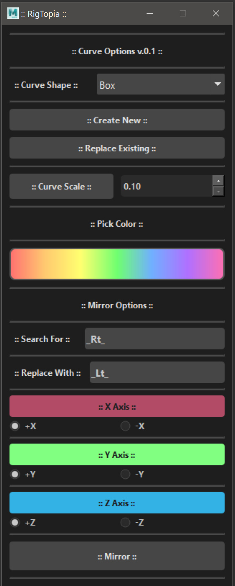

# Curve Multiple Options

**Streamline the creation, customization, and management of curve shapes in Autodesk Maya with an intuitive PyQt-based tool.**

## Overview
Crv Multiple Options is a powerful, lightweight script tailored to enhance productivity in Autodesk Maya. Whether you're creating new curve shapes, replacing existing ones, or modifying them with precision, this tool provides a seamless workflow to handle complex tasks effortlessly.

## Key Features
- **User-Friendly PyQt Interface**  
  A sleek and intuitive UI designed for both beginners and professionals, enabling quick access to essential curve editing functions.
  
- **Shape Replacement with Connection Preservation**  
  Replace curve shapes without disrupting their connections, ensuring smooth operation in complex scenes.

- **Advanced Search and Replace**  
  Mirror curves across any axis (X, Y, Z) or flip their orientation, regardless of naming conventions or prefixes, providing maximum flexibility and control.

- **Additional Utilities**  
  Colorize, scale, and fine-tune curve shapes directly within the UI to meet specific project requirements.

## UI Template


## Installation
Download and place the folder Copy the crv_options folder into: C:\Users<username>\Documents\maya\scripts
Run the script in Maya Script Editor:
```python
import crv_options.main as main
from crv_options.main import CurveOptionsMain

if __name__ == "__main__":
    try:
        global _main_
        _main_.close()
        _main_.deleteLater()

    except:
        pass
    _main_ = CurveOptionsMain()
    _main_.show()
```

## Usage
1. Execute the script in Autodesk Maya to launch the Crv Multiple Options UI.
2. Use the UI to create, edit, or replace curve shapes as per your project needs.
3. Customize and optimize shapes efficiently, reducing manual effort.

## Compatibility
- **Supported Software**: Autodesk Maya  
- **Versions**: Fully compatible with Maya 2022 and later.

## Contributions
We welcome contributions! Whether it's reporting issues, suggesting new features, or improving the script, your input is invaluable. Feel free to submit pull requests or open issues in the repository.

## License
This project is licensed under the [MIT License](LICENSE), making it open for personal and commercial use. 

---
Elevate your workflow and simplify curve management with **Crv Multiple Options**.
